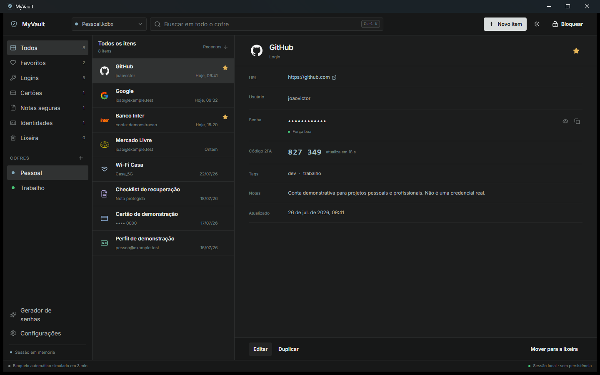

<div align="center">

# MyVault

### Um gerenciador de credenciais local-first com experiência desktop moderna

[](https://github.com/johnnymeunome/MyVault/actions/workflows/ci.yml)
[](LICENSE)
[](https://v2.tauri.app/)
[](https://react.dev/)
[](https://www.typescriptlang.org/)

**M0 e M1 concluídos** — interface final validada no aplicativo real e leitura KDBX experimental somente de fixtures.

[Preview](#preview-do-produto) · [Visão geral](#visão-geral) · [Design](#sistema-de-design) · [Funcionalidades](#funcionalidades) · [Executar](#como-executar) · [Arquitetura](#arquitetura) · [Roadmap](#roadmap)

</div>

## Preview do produto

<p align="center">
  <a href="docs/references/myvault-m1-final.png">
    
  </a>
</p>

<p align="center">
  <sub>Aplicativo Tauri real em 1440 × 900: base neutra, estrutura integral, iconografia contextual e azul-aço reservado para foco e identidade — clique para ampliar.</sub>
</p>

> [!WARNING]
> **Não use o MyVault para armazenar credenciais reais.** O M1 abre apenas fixtures públicas e descartáveis em modo somente leitura. Escrita KDBX, recuperação, proteção de memória e auditoria independente ainda não foram implementadas.

## Visão geral

MyVault é um projeto open source de portfólio que explora como um gerenciador de credenciais local pode combinar transparência técnica, propriedade dos dados e uma interface desktop contemporânea.

O produto foi iniciado pela experiência e pela arquitetura — não pela criptografia. O M0 entrega a base visual mockada; o M1 acrescenta um núcleo Rust experimental que abre fixtures KDBX em modo somente leitura e devolve à interface apenas uma projeção não secreta.

Princípios do projeto:

- **local-first:** nenhuma conta online, servidor, telemetria ou chamada externa;
- **honestidade de segurança:** o aplicativo informa claramente o que ainda não protege;
- **experiência desktop:** interface compacta, acessível e orientada a teclado;
- **interoperabilidade progressiva:** compatibilidade KDBX em vez de um formato proprietário;
- **limites claros:** operações sensíveis deverão acontecer atrás de comandos Tauri restritos.

MyVault é uma aplicação original em Tauri e React. **Não é um fork nem uma reimplementação visual do KeePassXC.**

## Status do projeto

| Área                      | Estado atual                                      |
| ------------------------- | ------------------------------------------------- |
| Interface desktop         | Implementada e validada no aplicativo real        |
| Dados de demonstração     | Somente em memória                                |
| Busca e filtros           | Implementados                                     |
| Criação e edição          | Simuladas apenas no modo mock                     |
| Gerador de senhas         | Implementado e testado                            |
| Bloqueio do cofre         | Simulado; encerra a sessão KDBX                   |
| Clipboard                 | Limpeza best-effort apenas no modo mock           |
| Persistência              | Não implementada                                  |
| Criptografia              | Parser KDBX de terceiro, experimental             |
| KDBX                      | Leitura experimental somente de fixtures públicas |
| Uso com credenciais reais | **Não recomendado**                               |

## Funcionalidades

### Navegação e organização

- seletor de cofres mockados;
- categorias para logins, cartões, notas seguras e identidades;
- favoritos e lixeira;
- busca por título, usuário, URL e tags;
- seleção de item com painel detalhado;
- logos reconhecíveis e ícones contextuais para identificar rapidamente cada entrada;
- layout integral validado de 1040 × 680 a 1440 × 900.

### Entradas

- criação e edição de logins;
- duplicação e exclusão para lixeira;
- exibição e ocultação de senha;
- cópia de usuário, senha e código TOTP demonstrativo;
- tags, notas, favorito e indicador de força;
- alterações mantidas somente durante a sessão.

### Produtividade

- paleta de comandos com `Ctrl + K` ou `⌘ + K`;
- gerador configurável de senhas;
- alternância entre tema escuro e claro;
- feedback visual de clipboard;
- contagem regressiva para limpeza best-effort;
- tela de bloqueio e desbloqueio simulados.

### KDBX M1 experimental

- seleção de fixture por diálogo nativo do Tauri;
- leitura KDBX 3.1, 4.0 e 4.1 com AES-256 ou ChaCha20;
- derivação por AES-KDF, Argon2d e Argon2id;
- abertura por senha ou senha com arquivo-chave;
- sessão opaca mantida no processo Rust;
- projeção allowlist de grupos e resumos de entradas, sem senha, TOTP, notas, histórico ou anexos;
- fechamento da sessão ao bloquear, fechar o cofre ou descarregar a interface;
- erros públicos fechados, sem caminhos locais ou mensagens internas.

### Qualidade

- TypeScript em modo strict;
- regras de senha implementadas como funções puras;
- 28 testes frontend e 8 testes do núcleo Rust;
- ESLint e Prettier;
- pipeline público de CI;
- auditorias npm e Cargo sem vulnerabilidades conhecidas no estado atual dos lockfiles.

## Stack

| Camada        | Tecnologia                  |
| ------------- | --------------------------- |
| Shell desktop | Tauri 2                     |
| Interface     | React 19 + TypeScript       |
| Build         | Vite 7                      |
| Estilos       | Tailwind CSS 4 + tokens CSS |
| Componentes   | Base UI + Motion for React  |
| Ícones        | Lucide React + React Icons  |
| Estado        | Zustand                     |
| Testes        | Vitest + Testing Library    |
| Qualidade     | ESLint + Prettier           |
| Núcleo nativo | Rust + `keepass` 0.13.17    |

## Sistema de design

A identidade do MyVault combina a sobriedade e a densidade de ferramentas modernas de desenvolvimento com uma assinatura azul-aço própria. Superfícies neutras priorizam os dados; o azul identifica marca, navegação, foco e informação; verde, âmbar e vermelho permanecem reservados para estados semânticos.

A inspiração no Codex acontece no nível de princípios visuais — hierarquia, temperatura de cor e organização desktop. O MyVault não reutiliza marca, ativos ou componentes proprietários do Codex.

As regras de cores, tipografia, espaçamento, layout, componentes, logos, conteúdo de segurança e acessibilidade estão no [sistema de design completo](docs/DESIGN-SYSTEM.md).

## Como executar

### Pré-requisitos para o frontend

- Node.js 20.19 ou superior — Node 22 LTS é recomendado;
- npm 10 ou superior;
- Git.

### Instalação

```bash
git clone https://github.com/johnnymeunome/MyVault.git
cd MyVault
npm ci
```

### Modo de desenvolvimento web

```bash
npm run dev
```

Abra `http://localhost:1420` caso o navegador não seja iniciado automaticamente.

### Aplicativo desktop com Tauri

Instale primeiro os [pré-requisitos do Tauri 2](https://v2.tauri.app/start/prerequisites/), incluindo Rust e as ferramentas nativas da sua plataforma. Depois execute:

```bash
npm run tauri -- dev
```

No aplicativo desktop, use **Abrir fixture KDBX** e selecione um arquivo de `src-tauri/tests/fixtures/kdbx`. As fixtures protegidas apenas por senha usam `demopass`; a fixture combinada também exige o arquivo-chave público disponível na mesma pasta. Esses dados são deliberadamente públicos e servem somente para teste.

## Comandos disponíveis

| Comando                              | Finalidade                                   |
| ------------------------------------ | -------------------------------------------- |
| `npm run dev`                        | Inicia o Vite em modo de desenvolvimento     |
| `npm run build`                      | Executa o typecheck e gera o build web       |
| `npm run preview`                    | Serve localmente o build gerado              |
| `npm run lint`                       | Valida o código com ESLint                   |
| `npm run typecheck`                  | Verifica os tipos sem emitir arquivos        |
| `npm run test`                       | Executa todos os testes uma vez              |
| `npm run test:watch`                 | Executa os testes em modo interativo         |
| `npm run format`                     | Formata os arquivos com Prettier             |
| `npm run format:check`               | Verifica a formatação sem modificar arquivos |
| `npm run tauri -- dev`               | Abre o aplicativo no shell desktop           |
| `npm run tauri -- build --no-bundle` | Gera o executável desktop sem instalador     |

Para reproduzir a mesma validação usada no CI:

```bash
npm ci
npm run lint
npm run typecheck
npm run test
npm run build
cd src-tauri
cargo fmt --check
cargo clippy --all-targets -- -D warnings
cargo test --lib
```

## Atalhos

| Atalho                | Ação                       |
| --------------------- | -------------------------- |
| `Ctrl + K` / `⌘ + K`  | Abrir a paleta de comandos |
| `Esc`                 | Fechar diálogos e a paleta |
| `Tab` / `Shift + Tab` | Navegar entre controles    |
| `Enter` / `Espaço`    | Ativar o item em foco      |

## Arquitetura


O frontend não acessa diretamente filesystem, keychain ou outras APIs sensíveis. A leitura experimental é exposta por comandos Tauri pequenos, tipados e explicitamente autorizados.

```text
src/
├── app/                    # composição da aplicação
├── components/             # UI, layout e componentes comuns
├── features/               # entradas, busca, clipboard, gerador e cofre
├── domain/                 # entidades, contratos e regras puras
├── infrastructure/         # mocks, armazenamento e gateways Tauri
├── stores/                 # estado de sessão com Zustand
├── styles/                 # tokens e estilos globais
└── types/                  # tipos compartilhados

src-tauri/
├── capabilities/           # permissões mínimas do shell
└── src/
    ├── commands/           # comandos expostos ao frontend
    ├── security/           # validações e limites de segurança
    └── vault/              # serviço e sessão KDBX somente leitura
```

Detalhes adicionais estão em [docs/ARCHITECTURE.md](docs/ARCHITECTURE.md).

### Implementação técnica do M1

O M1 foi implementado com limites verificáveis e documentação de suporte:

- [especificação, contratos e critérios de aceite](docs/M1-SPEC.md);
- [modelo de ameaças](docs/THREAT-MODEL.md);
- [matriz de compatibilidade KDBX](docs/KDBX-COMPATIBILITY.md);
- [decisão sobre o parser Rust](docs/DECISIONS/004-keepass-rs-read-only-spike.md);
- [política de fixtures descartáveis](src-tauri/tests/fixtures/kdbx/README.md).

O M1 é desktop, experimental e somente leitura. A UI recebe apenas resumos não secretos; senha, TOTP, notas, histórico e anexos não atravessam o IPC. A implementação, a validação automatizada e o fluxo interativo do Tauri no Windows foram concluídos em 2026-07-28.

## Segurança e privacidade

O preview web do M0 continua mockado. No desktop, o M1 acrescenta leitura experimental de fixtures públicas e descartáveis. Valores mockados permanecem em memória JavaScript; a base KDBX fica no processo Rust durante a sessão, enquanto a senha efêmera é usada somente na abertura e não retorna pelo IPC.

O que a implementação atual faz:

- não utiliza `localStorage`, IndexedDB ou banco de dados;
- não envia telemetria nem realiza chamadas de rede;
- não registra senhas em logs;
- abre a fixture com acesso somente leitura e aplica limites de tamanho e estrutura;
- mantém a base KDBX em uma sessão opaca no processo Rust;
- expõe ao frontend apenas campos não secretos em allowlist;
- mantém a superfície Tauri restrita a comandos tipados;
- isola o clipboard atrás de um gateway substituível.

O que a implementação atual **não** garante:

- confidencialidade dos valores em memória;
- proteção contra malware ou captura de tela;
- limpeza confiável do clipboard em todos os sistemas;
- escrita, recuperação ou backup de um cofre;
- segurança para credenciais reais;
- compatibilidade com todo arquivo produzido pelo ecossistema KDBX;
- auditoria de segurança independente.

Leia [docs/SECURITY-NOTES.md](docs/SECURITY-NOTES.md) antes de trabalhar em qualquer funcionalidade sensível. Para reportar um problema de segurança, não publique credenciais ou detalhes exploráveis em uma issue pública; entre em contato com o mantenedor pelo [perfil no GitHub](https://github.com/johnnymeunome).

## Roadmap

```text
M0  Product shell                      ✅ concluído
 │   interface, mocks, arquitetura e testes
 ▼
M1  Núcleo KDBX experimental           ✅ concluído
 │   leitura de fixtures em modo somente leitura, validada no Windows
 ▼
M2  Escrita segura                     futuro
 │   gravação atômica, backups e compatibilidade
 ▼
M3  Proteções locais                   futuro
 │   auto-lock, clipboard, memória, keychain e logs
 ▼
M4  Release experimental               futuro
     builds assinados e validação multiplataforma
```

Nenhuma versão será apresentada como pronta para produção antes de testes de interoperabilidade, modelagem de ameaças e auditoria independente. Veja o [roadmap detalhado](docs/ROADMAP.md).

## Decisões importantes

- [ADR 001 — Tauri 2 com React](docs/DECISIONS/001-tauri-react.md)
- [ADR 002 — Compatibilidade KDBX futura](docs/DECISIONS/002-kdbx-future-compatibility.md)
- [ADR 003 — Linguagem visual inspirada no Codex](docs/DECISIONS/003-codex-inspired-visual-language.md)
- [ADR 004 — Biblioteca Rust para o spike KDBX somente leitura](docs/DECISIONS/004-keepass-rs-read-only-spike.md)

## Como contribuir

Contribuições são bem-vindas, especialmente em acessibilidade, testes, experiência desktop e documentação.

1. Leia [CONTRIBUTING.md](CONTRIBUTING.md).
2. Crie um fork e um branch focado.
3. Não inclua credenciais reais em fixtures, screenshots, issues ou logs.
4. Execute toda a suíte de validação.
5. Abra um pull request explicando impacto e testes realizados.

Mudanças em criptografia, KDBX, persistência de segredos ou permissões Tauri exigem antes uma decisão arquitetural e análise de ameaças.

## Licença

Distribuído sob a [licença MIT](LICENSE).

## Autor

Projeto de portfólio desenvolvido por [João Victor](https://github.com/johnnymeunome).

---

<div align="center">

**MyVault M1 — leitura experimental, somente fixtures, segurança sem atalhos.**

</div>
