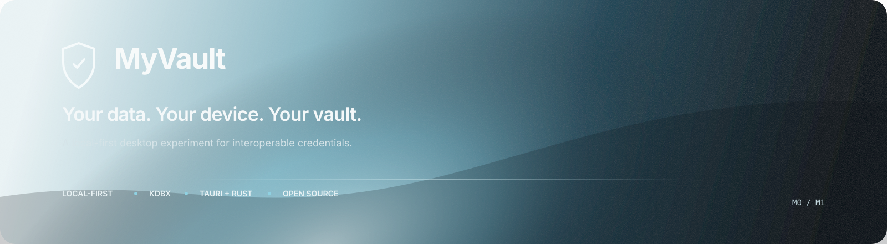
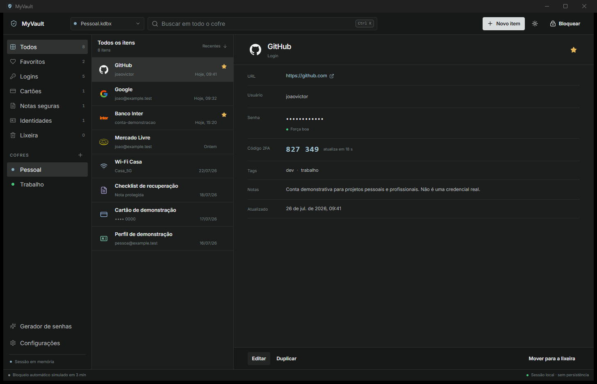
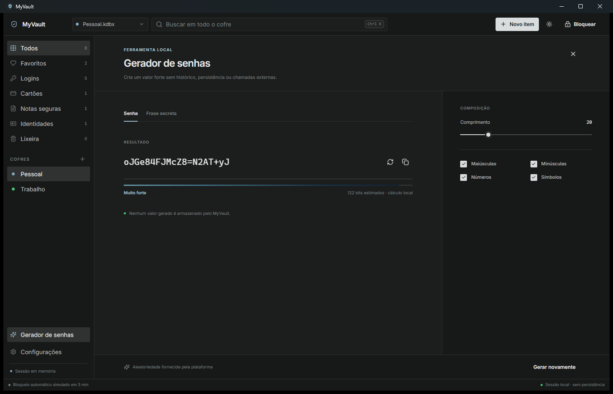
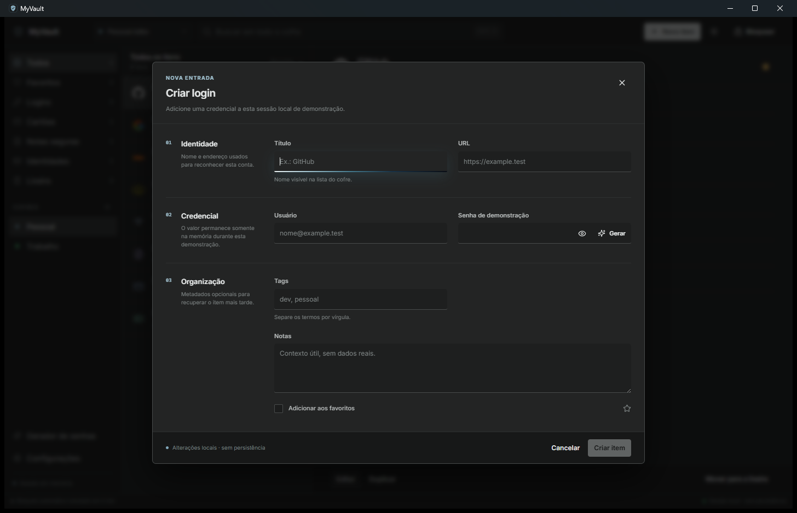
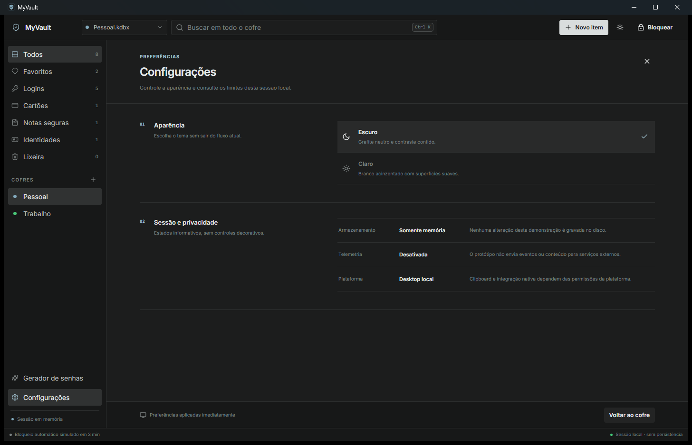
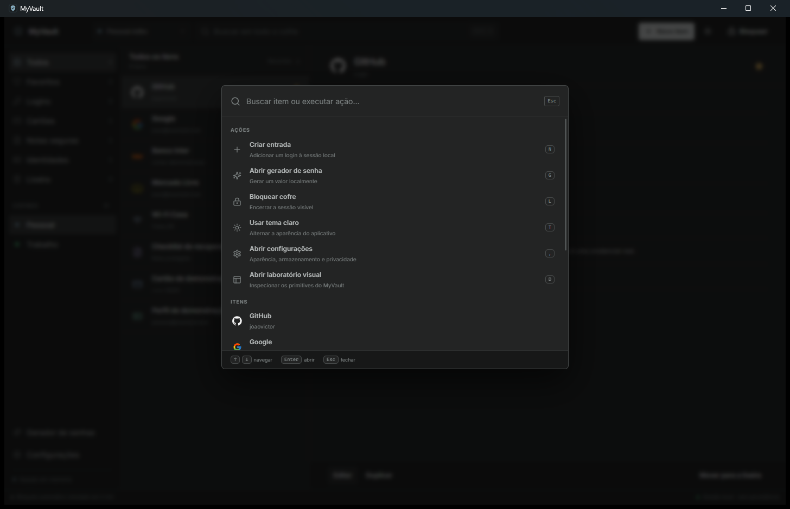
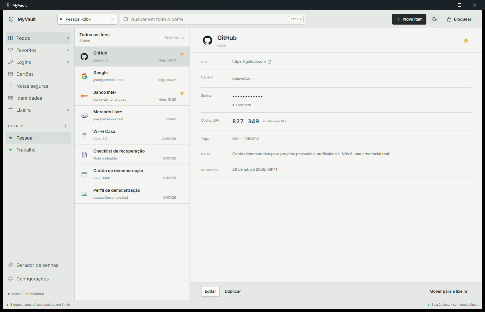
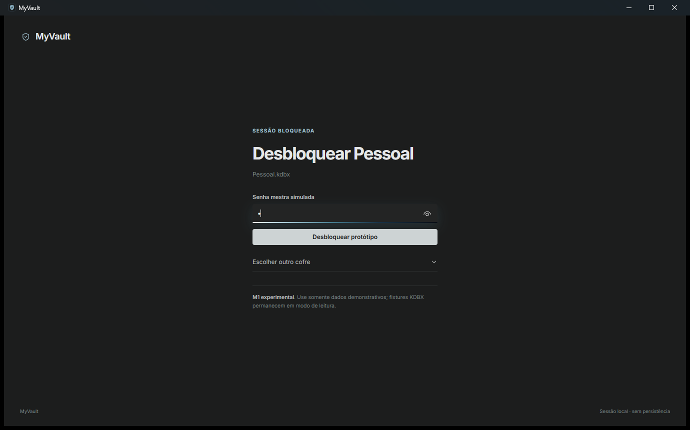
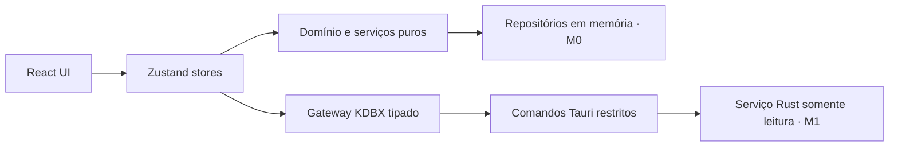

<div align="center">

<a href="docs/references/myvault-brand-spectrum.svg">
  
</a>

# MyVault

### Um gerenciador de credenciais local-first, pensado como produto desktop de verdade.

[](https://github.com/johnnymeunome/MyVault/actions/workflows/ci.yml)
[](LICENSE)
[](https://v2.tauri.app/)
[](https://react.dev/)
[](https://www.typescriptlang.org/)

**M0 e M1 concluídos** · interface validada no aplicativo real · leitura KDBX experimental e somente de fixtures

[Produto](#produto) · [Interface](#interface-real) · [Design](#linguagem-visual) · [Segurança](#segurança-sem-atalhos) · [Executar](#executar-localmente) · [Arquitetura](#arquitetura) · [Roadmap](#roadmap)

</div>

> [!WARNING]
> **Não use o MyVault para armazenar credenciais reais.** O M1 abre somente fixtures públicas e descartáveis em modo somente leitura. Escrita KDBX, recuperação, proteção de memória e auditoria independente ainda não foram implementadas.

## Produto

MyVault é um projeto open source de portfólio sobre uma pergunta simples: como seria um gerenciador de credenciais local que tratasse segurança, interoperabilidade e experiência desktop como partes do mesmo produto?

O projeto começou pela experiência e pela arquitetura — não por criptografia própria. O M0 estabeleceu o shell e os fluxos; o M1 adicionou um núcleo Rust experimental capaz de abrir fixtures KDBX sem entregar campos secretos ao React.

| Princípio         | Decisão de produto                                                                    |
| ----------------- | ------------------------------------------------------------------------------------- |
| **Local-first**   | Sem conta, servidor, telemetria ou sincronização obrigatória.                         |
| **Interoperável** | Evolução orientada ao formato KDBX, nunca a um cofre proprietário improvisado.        |
| **Honesto**       | Limites de segurança permanecem visíveis na interface e na documentação.              |
| **Desktop**       | Densidade, teclado, estados de foco e uso integral da janela são requisitos centrais. |
| **Original**      | MyVault é uma aplicação própria em Tauri e React; **não é um fork do KeePassXC**.     |

## Interface real

As imagens abaixo foram capturadas diretamente do aplicativo Tauri no Windows. Não são renders, conceitos ou mocks estáticos.

<p align="center">
  <a href="docs/references/myvault-dashboard-dark.png">
    
  </a>
</p>

<p align="center">
  <sub>Dashboard integral · navegação compacta · logos e ícones contextuais · dados demonstrativos em memória</sub>
</p>

### Fluxos e peças do sistema

<table>
  <tr>
    <td width="50%" valign="top">
      <a href="docs/references/myvault-password-generator.png">
        
      </a>
      <br><strong>Gerador de senhas</strong><br>
      <sub>Experiência dedicada, composição configurável, estimativa local e movimento funcional.</sub>
    </td>
    <td width="50%" valign="top">
      <a href="docs/references/myvault-new-entry.png">
        
      </a>
      <br><strong>Nova entrada</strong><br>
      <sub>Formulário por seções, labels persistentes, foco claro e ações sem ornamentação excessiva.</sub>
    </td>
  </tr>
  <tr>
    <td width="50%" valign="top">
      <a href="docs/references/myvault-settings.png">
        
      </a>
      <br><strong>Configurações</strong><br>
      <sub>Aparência, privacidade e limites da sessão apresentados como informação operacional.</sub>
    </td>
    <td width="50%" valign="top">
      <a href="docs/references/myvault-command-palette.png">
        
      </a>
      <br><strong>Paleta de comandos</strong><br>
      <sub>Ações e entradas reunidas em um fluxo navegável por teclado com Ctrl K.</sub>
    </td>
  </tr>
  <tr>
    <td width="50%" valign="top">
      <a href="docs/references/myvault-dashboard-light.png">
        
      </a>
      <br><strong>Tema claro acinzentado</strong><br>
      <sub>Contraste contido, superfícies neutras e o mesmo peso visual do tema escuro.</sub>
    </td>
    <td width="50%" valign="top">
      <a href="docs/references/myvault-lock-screen.png">
        
      </a>
      <br><strong>Sessão bloqueada</strong><br>
      <sub>Estado focado, silencioso e explícito sobre o caráter experimental do M1.</sub>
    </td>
  </tr>
</table>

## Linguagem visual

O redesign removeu padrões genéricos — cards para tudo, chips excessivos, raios grandes, contornos redundantes e ícones decorativos — em favor de hierarquia tipográfica, alinhamento, ritmo e estados claros.

O gradiente azul-aço é a assinatura da marca. Ele aparece em momentos de identidade e movimento; não compete com os dados durante o uso cotidiano.

<p align="center">
  
</p>

| Fundamento                  | Aplicação                                                                         |
| --------------------------- | --------------------------------------------------------------------------------- |
| **Grafite neutro**          | Base do tema escuro e plano de leitura principal.                                 |
| **Branco acinzentado**      | Tema claro com menos luminosidade e contraste mais confortável.                   |
| **Azul-aço**                | Marca, foco, informação e seleção — nunca decoração indiscriminada.               |
| **Verde, âmbar e vermelho** | Reservados a sucesso, atenção e ações destrutivas.                                |
| **Iconografia**             | Logos reconhecíveis quando existem; Lucide para ações e tipos genéricos.          |
| **Componentes**             | Primitives Base UI, estados acessíveis e anatomia visual específica do MyVault.   |
| **Movimento**               | Motion for React para explicar mudança, força e geração; respeita reduced motion. |

As regras completas estão em [docs/DESIGN-SYSTEM.md](docs/DESIGN-SYSTEM.md). O processo de inspeção e as decisões do redesign permanecem registrados em [docs/INTERFACE-REVIEW.md](docs/INTERFACE-REVIEW.md) e [docs/INTERFACE-REDESIGN-PLAN.md](docs/INTERFACE-REDESIGN-PLAN.md).

## O que já funciona

### Organização e entradas

- cofres mockados, categorias, favoritos e lixeira;
- busca por título, usuário, URL e tags;
- logos reconhecíveis e ícones contextuais por tipo de entrada;
- criação, edição, duplicação e exclusão simuladas em memória;
- exibição, ocultação e cópia de valores demonstrativos;
- tags, notas, favorito, indicador de força e TOTP demonstrativo.

### Produtividade

- paleta de comandos com `Ctrl + K` ou `⌘ + K`;
- gerador de senhas e frases secretas com regras testadas;
- temas escuro e claro acinzentado;
- feedback e limpeza best-effort do clipboard no modo mock;
- bloqueio de sessão e troca de cofre;
- navegação por teclado e suporte a redução de movimento.

### KDBX M1 experimental

- seleção de fixture por diálogo nativo do Tauri;
- leitura KDBX 3.1, 4.0 e 4.1 com AES-256 ou ChaCha20;
- derivação por AES-KDF, Argon2d e Argon2id;
- abertura por senha ou senha com arquivo-chave;
- sessão opaca mantida no processo Rust;
- projeção allowlist de grupos e resumos de entradas;
- fechamento da sessão ao bloquear, trocar o cofre ou descarregar a interface;
- erros públicos sem caminhos locais ou mensagens internas.

## Estado atual

| Área                      | Estado                                                           |
| ------------------------- | ---------------------------------------------------------------- |
| Interface desktop         | Implementada, redesenhada e validada no aplicativo real          |
| Dashboard                 | Temas escuro e claro, layout integral de 1040 × 680 a 1440 × 900 |
| Dados mockados            | Somente em memória                                               |
| Gerador de senhas         | Implementado e testado                                           |
| Criação e edição          | Simuladas no modo mock                                           |
| KDBX                      | Leitura experimental somente de fixtures públicas                |
| Persistência e escrita    | Não implementadas                                                |
| Uso com credenciais reais | **Não recomendado**                                              |

## Arquitetura



O frontend não acessa diretamente filesystem, keychain ou APIs sensíveis. A leitura experimental é exposta por comandos Tauri pequenos e tipados; senha, TOTP, notas, histórico e anexos não atravessam o IPC.

```text
src/
├── app/                 # composição da aplicação
├── components/          # shell, layout e elementos comuns
├── design-system/       # primitives e laboratório visual
├── features/            # entradas, busca, gerador e cofre
├── domain/              # entidades, contratos e regras puras
├── infrastructure/      # mocks, clipboard e gateway Tauri
├── stores/              # estado de sessão com Zustand
└── styles/              # tokens, temas e estilos globais

src-tauri/
├── capabilities/        # permissões mínimas do shell
└── src/
    ├── commands/        # comandos expostos ao frontend
    ├── security/        # validações e limites
    └── vault/           # sessão KDBX somente leitura
```

Leia a visão detalhada em [docs/ARCHITECTURE.md](docs/ARCHITECTURE.md).

## Segurança sem atalhos

O MyVault ainda é um experimento. A interface comunica essa condição porque segurança não deve ser inferida apenas pela aparência do produto.

**A implementação atual:**

- não usa `localStorage`, IndexedDB ou banco de dados;
- não envia telemetria nem realiza chamadas externas;
- não registra senhas em logs;
- abre fixtures com acesso somente leitura e limites de tamanho e estrutura;
- mantém a base KDBX em sessão opaca no processo Rust;
- expõe ao React apenas campos não secretos em allowlist;
- restringe a superfície Tauri a comandos tipados.

**A implementação atual não garante:**

- confidencialidade de valores na memória;
- proteção contra malware ou captura de tela;
- limpeza confiável do clipboard em todos os sistemas;
- escrita, recuperação ou backup de cofres;
- compatibilidade com qualquer arquivo do ecossistema KDBX;
- segurança para credenciais reais ou auditoria independente.

Antes de trabalhar em qualquer funcionalidade sensível, leia [docs/SECURITY-NOTES.md](docs/SECURITY-NOTES.md) e [docs/THREAT-MODEL.md](docs/THREAT-MODEL.md).

## Executar localmente

### Pré-requisitos

- Node.js 20.19 ou superior — Node 22 LTS recomendado;
- npm 10 ou superior;
- Git;
- para o desktop: Rust e os [pré-requisitos do Tauri 2](https://v2.tauri.app/start/prerequisites/).

```bash
git clone https://github.com/johnnymeunome/MyVault.git
cd MyVault
npm ci
```

### Preview web

```bash
npm run dev
```

Abra `http://localhost:1420` se o navegador não iniciar automaticamente.

### Aplicativo desktop

```bash
npm run tauri -- dev
```

No desktop, use **Abrir fixture KDBX** e selecione um arquivo em `src-tauri/tests/fixtures/kdbx`. As fixtures protegidas apenas por senha usam `demopass`; a fixture combinada também exige o arquivo-chave público da mesma pasta.

## Qualidade e testes

| Verificação       | Comando                                                     |
| ----------------- | ----------------------------------------------------------- |
| Lint              | `npm run lint`                                              |
| TypeScript strict | `npm run typecheck`                                         |
| Testes frontend   | `npm run test`                                              |
| Formatação        | `npm run format:check`                                      |
| Build web         | `npm run build`                                             |
| Testes Rust       | `cd src-tauri && cargo test --lib`                          |
| Clippy            | `cd src-tauri && cargo clippy --all-targets -- -D warnings` |
| Build desktop     | `npm run tauri -- build --no-bundle`                        |

Estado validado: **28 testes frontend**, **8 testes Rust**, lint, tipos, formatação, auditorias e build Tauri no Windows.

## Stack

| Camada          | Tecnologia                 |
| --------------- | -------------------------- |
| Shell desktop   | Tauri 2                    |
| Interface       | React 19 + TypeScript      |
| Build           | Vite 7 + Tailwind CSS 4    |
| Componentes     | Base UI + Motion for React |
| Ícones e marcas | Lucide React + React Icons |
| Estado          | Zustand                    |
| Testes          | Vitest + Testing Library   |
| Núcleo nativo   | Rust + `keepass` 0.13.19   |

## Roadmap

```text
M0  Produto e shell visual              ✅ concluído
 │   fluxos mockados, arquitetura e testes
 ▼
M1  Núcleo KDBX experimental            ✅ concluído
 │   leitura de fixtures em modo somente leitura
 ▼
M2  Escrita segura                      planejamento
 │   cópia verificada antes de mutação ou substituição
 ▼
M3  Proteções locais                    futuro
 │   auto-lock real, clipboard, memória, keychain e logs
 ▼
M4  Release experimental                futuro
     builds assinados e validação multiplataforma
```

Nenhuma versão será apresentada como pronta para produção antes de testes de interoperabilidade, modelagem de ameaças e auditoria independente. O M2 já possui [especificação](docs/M2-SPEC.md), [ADR](docs/DECISIONS/005-safe-kdbx-copy-on-write.md) e [delta de ameaças](docs/M2-THREAT-MODEL.md), mas nenhuma escrita foi implementada. Veja [docs/ROADMAP.md](docs/ROADMAP.md).

## Documentação

| Documento                                               | Conteúdo                                    |
| ------------------------------------------------------- | ------------------------------------------- |
| [Produto](docs/PRODUCT.md)                              | visão, público, princípios e limites        |
| [Arquitetura](docs/ARCHITECTURE.md)                     | camadas, fronteiras e fluxo de dados        |
| [Sistema de design](docs/DESIGN-SYSTEM.md)              | tokens, componentes, temas e acessibilidade |
| [Especificação M1](docs/M1-SPEC.md)                     | contratos e critérios de aceite             |
| [Especificação M2](docs/M2-SPEC.md)                     | gates de escrita em cópia e recuperação     |
| [Compatibilidade KDBX](docs/KDBX-COMPATIBILITY.md)      | formatos, cifras, KDFs e fixtures           |
| [Modelo de ameaças](docs/THREAT-MODEL.md)               | ativos, riscos e controles                  |
| [Ameaças do M2](docs/M2-THREAT-MODEL.md)                | riscos adicionais de escrita e commit       |
| [Notas de segurança](docs/SECURITY-NOTES.md)            | garantias e limitações atuais               |
| [Política de segurança](SECURITY.md)                    | relato privado e divulgação responsável     |
| [Revisão de contribuições](docs/MAINTAINER-SECURITY.md) | execução segura de código não confiável     |
| [Decisões arquiteturais](docs/DECISIONS)                | ADRs do projeto                             |

## Contribuindo

Contribuições são bem-vindas, especialmente em acessibilidade, testes, experiência desktop e documentação.

1. Leia [CONTRIBUTING.md](CONTRIBUTING.md).
2. Crie um fork e uma branch focada.
3. Nunca inclua credenciais reais em fixtures, screenshots, issues ou logs.
4. Execute a suíte de validação.
5. Abra um pull request explicando impacto e testes realizados.

Mudanças em criptografia, KDBX, persistência de segredos ou permissões Tauri exigem antes uma decisão arquitetural e análise de ameaças.

## Licença e autoria

Distribuído sob a [licença MIT](LICENSE).

Projeto open source de portfólio desenvolvido por [João Victor](https://github.com/johnnymeunome).

---

<div align="center">

**MyVault — seus dados, seu dispositivo, seu cofre.**

</div>
