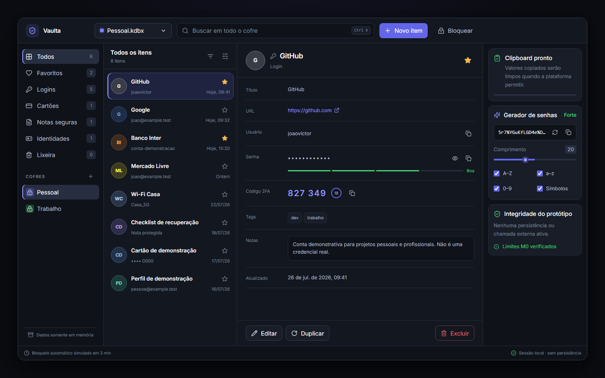

# Vaulta

[](https://github.com/johnnymeunome/vaulta/actions/workflows/ci.yml)
[](LICENSE)

Vaulta is an early-stage, local-first desktop password-manager concept. The current milestone (M0) is a navigable product shell with local mock data and no network calls.



> **Do not store real credentials in this version.** Encryption, KDBX support, secure memory handling and production-grade clipboard protections have not been implemented.

## What is included

- Desktop-oriented React interface with Tauri 2 scaffolding
- Search, category filters, favorites and entry actions
- In-memory create, edit, duplicate and trash flows
- Simulated lock screen and command palette (`Ctrl/Cmd + K`)
- Password generator with pure, tested rules
- Clipboard feedback and best-effort clearing timer
- Architectural boundaries for a future reviewed Rust vault core

## Requirements

- Node.js 20.19+ (or 22.12+)
- npm 10+
- For the native desktop window: the [Tauri 2 prerequisites](https://v2.tauri.app/start/prerequisites/), including Rust and platform build tools

## Install and run

```bash
npm install
npm run dev
```

For the native shell, after installing the Tauri prerequisites:

```bash
npm run tauri dev
```

## Quality checks

```bash
npm run lint
npm run typecheck
npm run test
npm run build
```

## Security status

All sample passwords are obvious fixtures kept only in application memory. No data is persisted to `localStorage`. Clipboard clearing is best-effort because browsers and operating systems can deny clipboard writes when the app is not focused. See [docs/SECURITY-NOTES.md](docs/SECURITY-NOTES.md).

## Next milestone

M1 will experiment with opening a **copy** of a test KDBX file in read-only mode, after selecting and reviewing a compatible implementation. It will not enable real credential storage.

## Contributing and license

Contributions are welcome. Read [CONTRIBUTING.md](CONTRIBUTING.md) before proposing security-sensitive changes. Vaulta is available under the [MIT License](LICENSE).
