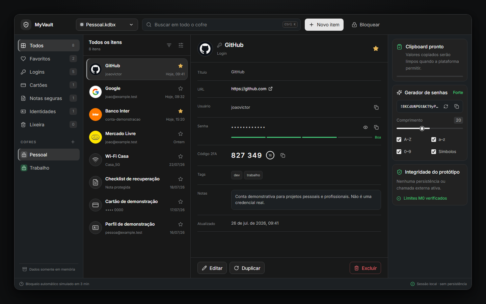
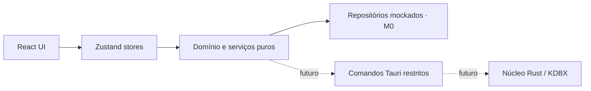

<div align="center">

# MyVault

### Um gerenciador de credenciais local-first com experiência desktop moderna

[](https://github.com/johnnymeunome/MyVault/actions/workflows/ci.yml)
[](LICENSE)
[](https://v2.tauri.app/)
[](https://react.dev/)
[](https://www.typescriptlang.org/)

**M0 · Product shell** — protótipo navegável com dados locais fictícios.

[Preview](#preview-do-produto) · [Visão geral](#visão-geral) · [Funcionalidades](#funcionalidades) · [Executar](#como-executar) · [Arquitetura](#arquitetura) · [Roadmap](#roadmap) · [Contribuir](#como-contribuir)

</div>

## Preview do produto

<p align="center">
  <a href="docs/references/myvault-m0-preview.png">
    
  </a>
</p>

<p align="center">
  <sub>Interface local-first inspirada em ferramentas modernas de desenvolvimento — clique na imagem para ampliar.</sub>
</p>

> [!WARNING]
> **Não use o MyVault para armazenar credenciais reais.** Este repositório está no marco M0: criptografia, leitura e escrita KDBX, proteção de memória e garantias nativas de clipboard ainda não foram implementadas.

## Visão geral

MyVault é um projeto open source de portfólio que explora como um gerenciador de credenciais local pode combinar transparência técnica, propriedade dos dados e uma interface desktop contemporânea.

O produto foi iniciado pela experiência e pela arquitetura — não pela criptografia. O marco atual entrega uma base visual funcional, totalmente mockada e sem persistência, pronta para receber no futuro um núcleo seguro em Rust e compatibilidade progressiva com arquivos KDBX.

Princípios do projeto:

- **local-first:** nenhuma conta online, servidor, telemetria ou chamada externa;
- **honestidade de segurança:** o aplicativo informa claramente o que ainda não protege;
- **experiência desktop:** interface compacta, acessível e orientada a teclado;
- **interoperabilidade futura:** compatibilidade KDBX em vez de um formato proprietário;
- **limites claros:** operações sensíveis deverão acontecer atrás de comandos Tauri restritos.

MyVault é uma aplicação original em Tauri e React. **Não é um fork nem uma reimplementação visual do KeePassXC.**

## Status do projeto

| Área                      | Estado no M0           |
| ------------------------- | ---------------------- |
| Interface desktop         | Implementada           |
| Dados de demonstração     | Somente em memória     |
| Busca e filtros           | Implementados          |
| Criação e edição          | Simuladas na sessão    |
| Gerador de senhas         | Implementado e testado |
| Bloqueio do cofre         | Simulado               |
| Clipboard                 | Limpeza best-effort    |
| Persistência              | Não implementada       |
| Criptografia              | Não implementada       |
| KDBX                      | Não implementado       |
| Uso com credenciais reais | **Não recomendado**    |

## Funcionalidades

### Navegação e organização

- seletor de cofres mockados;
- categorias para logins, cartões, notas seguras e identidades;
- favoritos e lixeira;
- busca por título, usuário, URL e tags;
- seleção de item com painel detalhado;
- layout adaptável para diferentes larguras desktop.

### Entradas

- criação e edição de logins;
- duplicação e exclusão para lixeira;
- exibição e ocultação de senha;
- cópia de usuário, senha e código TOTP demonstrativo;
- tags, notas, favorito e indicador de força;
- alterações mantidas somente durante a sessão.

### Produtividade

- paleta de comandos com `Ctrl + K` ou `⌘ + K`;
- gerador configurável de senhas;
- alternância entre tema escuro e claro;
- feedback visual de clipboard;
- contagem regressiva para limpeza best-effort;
- tela de bloqueio e desbloqueio simulados.

### Qualidade

- TypeScript em modo strict;
- regras de senha implementadas como funções puras;
- testes de domínio, estado e fluxos principais;
- ESLint e Prettier;
- pipeline público de CI;
- auditoria npm sem vulnerabilidades conhecidas no estado atual do lockfile.

## Stack

| Camada        | Tecnologia                          |
| ------------- | ----------------------------------- |
| Shell desktop | Tauri 2                             |
| Interface     | React 19 + TypeScript               |
| Build         | Vite 7                              |
| Estilos       | Tailwind CSS 4 + tokens CSS         |
| Componentes   | Radix primitives + padrão shadcn/ui |
| Ícones        | Lucide React                        |
| Estado        | Zustand                             |
| Testes        | Vitest + Testing Library            |
| Qualidade     | ESLint + Prettier                   |
| Núcleo nativo | Rust, ainda mínimo no M0            |

## Como executar

### Pré-requisitos para o frontend

- Node.js 20.19 ou superior — Node 22 LTS é recomendado;
- npm 10 ou superior;
- Git.

### Instalação

```bash
git clone https://github.com/johnnymeunome/MyVault.git
cd MyVault
npm ci
```

### Modo de desenvolvimento web

```bash
npm run dev
```

Abra `http://localhost:1420` caso o navegador não seja iniciado automaticamente.

### Aplicativo desktop com Tauri

Instale primeiro os [pré-requisitos do Tauri 2](https://v2.tauri.app/start/prerequisites/), incluindo Rust e as ferramentas nativas da sua plataforma. Depois execute:

```bash
npm run tauri -- dev
```

O shell Tauri está configurado, mas o núcleo Rust do M0 contém apenas limites e comandos demonstrativos.

## Comandos disponíveis

| Comando                | Finalidade                                   |
| ---------------------- | -------------------------------------------- |
| `npm run dev`          | Inicia o Vite em modo de desenvolvimento     |
| `npm run build`        | Executa o typecheck e gera o build web       |
| `npm run preview`      | Serve localmente o build gerado              |
| `npm run lint`         | Valida o código com ESLint                   |
| `npm run typecheck`    | Verifica os tipos sem emitir arquivos        |
| `npm run test`         | Executa todos os testes uma vez              |
| `npm run test:watch`   | Executa os testes em modo interativo         |
| `npm run format`       | Formata os arquivos com Prettier             |
| `npm run format:check` | Verifica a formatação sem modificar arquivos |
| `npm run tauri -- dev` | Abre o aplicativo no shell desktop           |

Para reproduzir a mesma validação usada no CI:

```bash
npm ci
npm run lint
npm run typecheck
npm run test
npm run build
```

## Atalhos

| Atalho                | Ação                       |
| --------------------- | -------------------------- |
| `Ctrl + K` / `⌘ + K`  | Abrir a paleta de comandos |
| `Esc`                 | Fechar diálogos e a paleta |
| `Tab` / `Shift + Tab` | Navegar entre controles    |
| `Enter` / `Espaço`    | Ativar o item em foco      |

## Arquitetura



O frontend não deve acessar diretamente filesystem, keychain ou outras APIs sensíveis. Essas capacidades serão expostas no futuro por comandos Tauri pequenos, tipados e explicitamente autorizados.

```text
src/
├── app/                    # composição da aplicação
├── components/             # UI, layout e componentes comuns
├── features/               # entradas, busca, clipboard, gerador e cofre
├── domain/                 # entidades, contratos e regras puras
├── infrastructure/         # mocks, armazenamento e gateways Tauri
├── stores/                 # estado de sessão com Zustand
├── styles/                 # tokens e estilos globais
└── types/                  # tipos compartilhados

src-tauri/
├── capabilities/           # permissões mínimas do shell
└── src/
    ├── commands/           # comandos expostos ao frontend
    ├── security/           # limite reservado para segurança
    └── vault/              # limite reservado para o cofre
```

Detalhes adicionais estão em [docs/ARCHITECTURE.md](docs/ARCHITECTURE.md).

## Segurança e privacidade

O M0 é um protótipo visual e arquitetural. As senhas incluídas no bundle são fixtures obviamente fictícias, e qualquer valor editado permanece em memória JavaScript apenas até a página ser recarregada.

O que o M0 faz:

- não utiliza `localStorage`, IndexedDB ou banco de dados;
- não envia telemetria nem realiza chamadas de rede;
- não registra senhas em logs;
- mantém a superfície Tauri no mínimo necessário;
- isola o clipboard atrás de um gateway substituível.

O que o M0 **não** garante:

- confidencialidade dos valores em memória;
- proteção contra malware ou captura de tela;
- limpeza confiável do clipboard em todos os sistemas;
- autenticação real por senha mestra;
- integridade, criptografia ou recuperação de um cofre;
- compatibilidade com arquivos KDBX.

Leia [docs/SECURITY-NOTES.md](docs/SECURITY-NOTES.md) antes de trabalhar em qualquer funcionalidade sensível. Para reportar um problema de segurança, não publique credenciais ou detalhes exploráveis em uma issue pública; entre em contato com o mantenedor pelo [perfil no GitHub](https://github.com/johnnymeunome).

## Roadmap

```text
M0  Product shell                      ✅ atual
 │   interface, mocks, arquitetura e testes
 ▼
M1  Núcleo KDBX experimental           planejado
 │   leitura de uma cópia de teste em modo somente leitura
 ▼
M2  Escrita segura                     futuro
 │   gravação atômica, backups e compatibilidade
 ▼
M3  Proteções locais                   futuro
 │   auto-lock, clipboard, memória, keychain e logs
 ▼
M4  Release experimental               futuro
     builds assinados e validação multiplataforma
```

Nenhuma versão será apresentada como pronta para produção antes de testes de interoperabilidade, modelagem de ameaças e auditoria independente. Veja o [roadmap detalhado](docs/ROADMAP.md).

## Decisões importantes

- [ADR 001 — Tauri 2 com React](docs/DECISIONS/001-tauri-react.md)
- [ADR 002 — Compatibilidade KDBX futura](docs/DECISIONS/002-kdbx-future-compatibility.md)

## Como contribuir

Contribuições são bem-vindas, especialmente em acessibilidade, testes, experiência desktop e documentação.

1. Leia [CONTRIBUTING.md](CONTRIBUTING.md).
2. Crie um fork e um branch focado.
3. Não inclua credenciais reais em fixtures, screenshots, issues ou logs.
4. Execute toda a suíte de validação.
5. Abra um pull request explicando impacto e testes realizados.

Mudanças em criptografia, KDBX, persistência de segredos ou permissões Tauri exigem antes uma decisão arquitetural e análise de ameaças.

## Licença

Distribuído sob a [licença MIT](LICENSE).

## Autor

Projeto de portfólio desenvolvido por [João Victor](https://github.com/johnnymeunome).

---

<div align="center">

**MyVault M0 — interface primeiro, segurança sem atalhos.**

</div>
