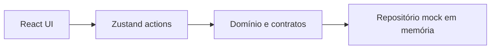
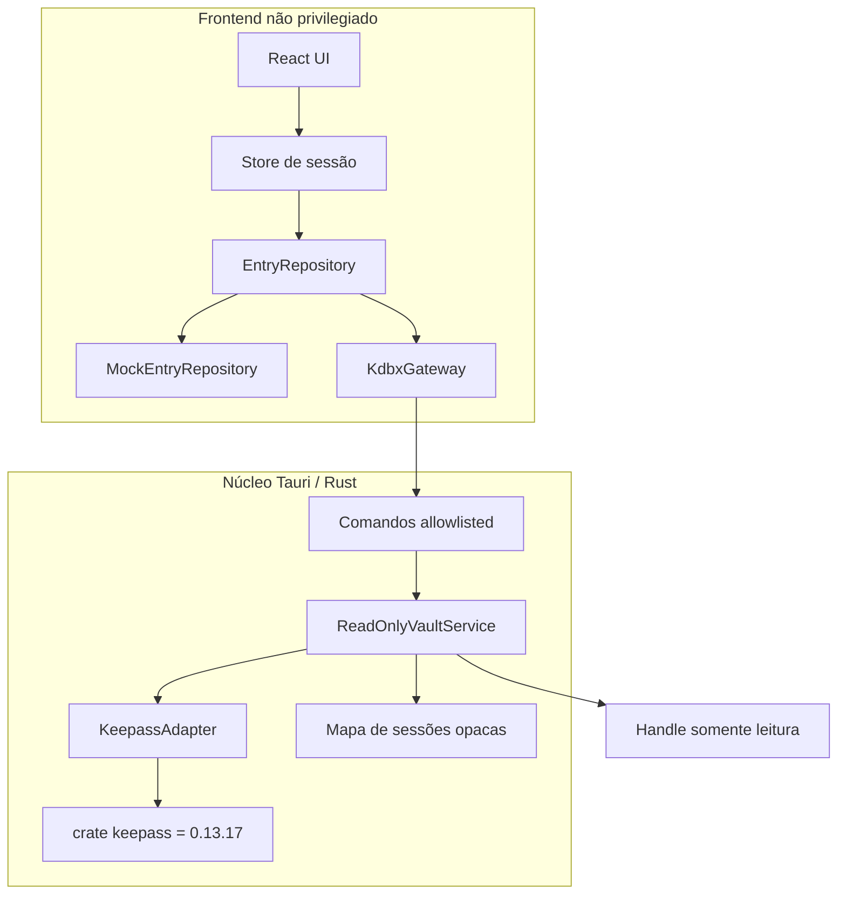

# Arquitetura

## Princípios

- a interface não acessa diretamente filesystem, criptografia ou APIs privilegiadas;
- regras de produto permanecem independentes do parser KDBX;
- toda capacidade nativa é pequena, tipada, negada por padrão e testável;
- o preview web continua funcional com mocks;
- dados secretos devem atravessar o menor número possível de fronteiras;
- a interface nunca promete uma proteção que o marco atual não entrega.

## Estado atual — M0



- `domain/` contém entidades portáveis, contratos e regras puras;
- `features/` contém comportamento e UI por funcionalidade;
- `stores/` coordena seleção, navegação e overlays da sessão;
- `infrastructure/mocks/` é a única origem de entradas no M0;
- `infrastructure/tauri/` reserva gateways para operações privilegiadas;
- `src-tauri/` tem uma superfície mínima e ainda não processa KDBX.

O store não usa middleware de persistência. Formulários, senhas geradas e alterações mockadas desaparecem ao recarregar.

## Evolução do M1



### Caminho de abertura

1. o seletor nativo devolve um caminho escolhido pela pessoa;
2. o frontend envia caminho, senha efêmera e arquivo-chave opcional;
3. o comando valida forma e limites básicos;
4. o serviço abre o mesmo arquivo com acesso somente leitura;
5. o adaptador valida e lê o KDBX;
6. o serviço guarda o banco no processo Rust e cria uma sessão opaca;
7. uma projeção allowlist, sem campos secretos, volta ao frontend;
8. fechar/bloquear invalida a sessão e descarta o estado.

### Contratos

O frontend dependerá de um gateway conceitual:

```ts
interface KdbxGateway {
  openReadOnly(request: OpenKdbxRequest): Promise<OpenKdbxResult>;
  close(sessionId: string): Promise<void>;
}
```

Os tipos do crate Rust não podem atravessar o IPC. `OpenKdbxResult` contém apenas identificador da sessão, versão do formato, grupos, resumos de entradas e capacidades fixas de leitura. O contrato completo está em [M1-SPEC.md](M1-SPEC.md).

### Estado e concorrência

- uma sessão KDBX ativa por janela no M1;
- abertura concorrente é rejeitada ou serializada;
- identificadores de entrada retornados são efêmeros;
- nenhum estado KDBX é persistido pelo Zustand;
- reload invalida a sessão anterior;
- erro durante abertura não substitui a fonte de dados atual.

### Erros

O adaptador converte erros da biblioteca em erros internos. O comando converte esses erros em uma enumeração pública fechada. Caminhos, backtraces e mensagens transitivas nunca são serializados. Consulte a tabela em [M1-SPEC.md](M1-SPEC.md#modelo-público-de-erros).

## Limite de permissões Tauri

O WebView não receberá permissão genérica de leitura do filesystem. A seleção usa diálogo nativo e o acesso acontece dentro de comando próprio. Novas permissões exigem justificativa, teste e atualização do [modelo de ameaças](THREAT-MODEL.md).

## Sistema de apresentação

A UI usa tokens CSS semânticos como fronteira entre intenção do produto e estilo. Superfícies neutras definem hierarquia; azul-aço identifica navegação, foco e informação; verde, âmbar e vermelho permanecem exclusivos de estados semânticos.

- `src/styles/tokens.css` é a fonte de verdade dos temas;
- `src/styles/globals.css` implementa layout e estados compartilhados;
- componentes consomem tokens em vez de cores isoladas;
- cores de serviços aparecem somente nos containers de logos;
- sessões do M1 reutilizam os mesmos componentes e acrescentam os estados **Experimental** e **Somente leitura**.

O contrato visual completo está em [DESIGN-SYSTEM.md](DESIGN-SYSTEM.md) e no [ADR 003](DECISIONS/003-codex-inspired-visual-language.md).

## Caminho posterior

M2 não será uma extensão automática do adaptador de leitura. Escrita exige serviço separado, salvamento em cópia, substituição atômica, backup, recuperação, interoperabilidade e decisão arquitetural própria. Até lá, nenhum método de mutação pertence aos contratos KDBX.
