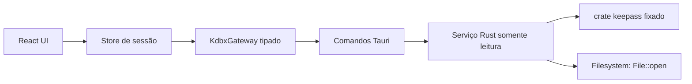

# M1 — Núcleo KDBX experimental

- **Status:** concluído em modo experimental
- **Data:** 2026-07-28
- **Modo:** somente leitura
- **Dados permitidos:** fixtures públicas e descartáveis

## Objetivo

O M1 prova que o MyVault consegue abrir uma cópia de teste de um arquivo KDBX, validar sua integridade e apresentar uma visão não secreta do conteúdo no aplicativo desktop. O marco reduz risco técnico antes de persistência, edição ou uso com credenciais reais.

O M1 não transforma o MyVault em um gerenciador de senhas seguro. O aviso do M0 permanece visível em toda a experiência experimental.

## Resultado esperado

O fluxo vertical mínimo é:

```text
seletor nativo de arquivo
        ↓
comando Tauri restrito
        ↓
abertura e validação no núcleo Rust
        ↓
sessão opaca somente leitura
        ↓
grupos e resumos não secretos na interface
        ↓
fechamento e descarte da sessão
```

Ao final do marco, uma fixture compatível poderá ser selecionada no desktop, desbloqueada com uma senha pública de teste e navegada na interface. O arquivo de origem deverá permanecer byte a byte inalterado.

## Escopo

### Incluído

- aplicativo desktop Tauri; o preview web continua usando mocks;
- seleção explícita de um único arquivo KDBX;
- senha e, em um caso de compatibilidade, arquivo-chave;
- leitura de KDBX 3.1, 4.0 e 4.1 conforme a [matriz de compatibilidade](KDBX-COMPATIBILITY.md);
- validação de cabeçalho, credenciais e integridade realizada pela biblioteca;
- grupos e resumos de entradas sem campos secretos;
- uma única sessão ativa por janela;
- erros tipados e mensagens públicas sem caminhos, chaves ou detalhes internos;
- limites iniciais contra consumo acidental ou malicioso de recursos;
- testes unitários, de integração e de não modificação do arquivo.

### Fora de escopo

- criar, editar, duplicar, excluir ou salvar entradas;
- escrita KDBX, migração de versão, backups ou recuperação;
- revelar ou copiar senhas, TOTP, notas, histórico ou anexos;
- lembrar senha, arquivo recente ou caminho do cofre;
- sincronização, importação, exportação, rede ou telemetria;
- suporte a challenge-response, hardware keys ou keychain;
- garantia de memória bloqueada ou resistência a malware local;
- uso com dados reais ou alegação de prontidão para produção.

## Fluxo de produto

1. A pessoa escolhe **Abrir fixture KDBX**.
2. O seletor nativo permite escolher um arquivo local.
3. A tela exibe o caminho apenas de forma reduzida e não o persiste.
4. A pessoa informa a senha pública da fixture e, quando aplicável, um arquivo-chave.
5. A interface envia uma única solicitação ao comando Tauri.
6. O núcleo Rust abre o arquivo sem permissão de escrita e cria uma sessão opaca.
7. A UI troca os mocks por grupos e resumos retornados, com os rótulos **Experimental** e **Somente leitura**.
8. Bloquear, fechar o cofre, trocar de arquivo ou encerrar a janela descarta a sessão.

Falhas preservam a tela anterior, limpam o campo de senha e mostram uma ação recuperável. Nenhum erro deve sugerir que o arquivo foi alterado.

## Fronteiras de arquitetura



- React não acessa filesystem, parser ou APIs criptográficas.
- O gateway é a única fronteira do frontend com os comandos nativos.
- O serviço Rust é responsável por validação, limites, mapeamento de erros e descarte.
- O parser fica atrás de uma interface interna para que a dependência possa ser substituída.
- Não será adicionada permissão ampla de filesystem ao WebView.

## Contrato inicial dos comandos

Os nomes e campos podem receber ajustes mecânicos durante a implementação, mas a exposição de dados não pode ser ampliada sem atualizar esta especificação e o modelo de ameaças.

### `open_kdbx_read_only`

Entrada:

```ts
type OpenKdbxRequest = {
  path: string;
  password: string;
  keyFilePath?: string;
};
```

Saída:

```ts
type OpenKdbxResult = {
  sessionId: string;
  database: {
    name: string;
    format: 'KDBX 3.1' | 'KDBX 4.0' | 'KDBX 4.1';
    groups: VaultGroupSummary[];
    entries: VaultEntrySummary[];
  };
  capabilities: {
    read: true;
    write: false;
    revealSecrets: false;
  };
};
```

`VaultEntrySummary` pode conter identificador efêmero, grupo, tipo, título, usuário, URL, favorito e data de atualização. Não pode conter senha, TOTP, notas, campos personalizados, histórico, anexos nem valores protegidos.

### `close_kdbx_session`

Entrada: `sessionId`.

Saída: confirmação sem dados do cofre. A operação deve ser idempotente.

## Ciclo de vida da sessão

- somente uma sessão ativa por janela no M1;
- identificador aleatório opaco, sem caminho ou metadados codificados;
- a senha existe no JavaScript apenas durante a solicitação e deve ser removida do estado assim que o comando terminar;
- no Rust, buffers próprios de senha devem usar limpeza best-effort ao serem descartados;
- o banco descriptografado permanece apenas no estado gerenciado pelo núcleo Rust;
- React recebe projeções não secretas, nunca o objeto do parser;
- fechar, bloquear, trocar de cofre ou encerrar a janela invalida a sessão;
- nenhuma sessão sobrevive a reinício, reload ou crash.

A limpeza de strings no JavaScript e de cópias internas de bibliotecas não pode ser garantida. Esse risco residual impede o uso de credenciais reais.

## Modelo público de erros

| Código                    | Significado apresentado à UI         | Comportamento                             |
| ------------------------- | ------------------------------------ | ----------------------------------------- |
| `CANCELLED`               | seleção cancelada                    | manter estado atual, sem alerta           |
| `FILE_NOT_FOUND`          | arquivo não encontrado               | permitir selecionar novamente             |
| `FILE_UNREADABLE`         | arquivo não pôde ser lido            | sugerir verificar permissões/cópia        |
| `UNSUPPORTED_VERSION`     | versão KDBX ainda não suportada      | informar a matriz alvo                    |
| `INVALID_KEY`             | senha ou arquivo-chave não aceito    | limpar senha e tentar novamente           |
| `INTEGRITY_FAILED`        | integridade do arquivo falhou        | interromper abertura e preservar origem   |
| `FORMAT_INVALID`          | conteúdo não é um KDBX válido        | interromper abertura                      |
| `RESOURCE_LIMIT_EXCEEDED` | arquivo excede limites experimentais | explicar que o limite é deliberado        |
| `INTERNAL`                | falha inesperada e redigida          | encerrar tentativa sem detalhes sensíveis |

Erros internos da biblioteca, mensagens do sistema operacional, stack traces e caminhos absolutos não atravessam o IPC. Logs registram apenas o código público, a etapa e um identificador aleatório da tentativa.

## Limites experimentais

Valores iniciais, revisáveis apenas por decisão documentada:

- tamanho máximo do arquivo: **64 MiB**;
- tamanho máximo do arquivo-chave: **1 MiB**;
- custo de memória declarado pelo KDF: **512 MiB**;
- iterações Argon2 declaradas pelo KDF: **100**;
- rodadas AES-KDF declaradas: **10.000.000**;
- tamanho máximo de um campo do cabeçalho externo: **1 MiB**;
- profundidade máxima de grupos: **64**;
- total máximo de grupos: **10.000**;
- total máximo de entradas: **10.000**;
- anexos: não projetados nem retornados à UI;
- uma abertura por vez, sem processamento concorrente;
- nenhuma chamada de rede.

Esses limites reduzem risco, mas não provam proteção completa contra arquivos maliciosos. A biblioteca ainda pode alocar ou descompactar conteúdo durante a leitura.

## Integração com o frontend

- criar um `KdbxGateway` ao lado das infraestruturas mockadas;
- adaptar o contrato de repositório para selecionar `mock` ou `nativeReadOnly` explicitamente;
- manter o preview web determinístico e funcional sem Tauri;
- desabilitar editar, duplicar, excluir, revelar, copiar e gerar/alterar senha em sessões KDBX;
- exibir a origem `Fixture KDBX`, a versão do formato e o estado somente leitura;
- usar os tokens e componentes definidos em [DESIGN-SYSTEM.md](DESIGN-SYSTEM.md);
- nunca confundir uma sessão experimental com o cofre pessoal mockado do M0.

## Plano de testes

### Rust

- abrir cada fixture válida da matriz;
- rejeitar senha errada e arquivo-chave ausente/incorreto;
- mapear versão incompatível, cabeçalho inválido, truncamento e falha de integridade;
- confirmar que nenhum campo secreto entra na projeção serializável;
- confirmar limites de tamanho e cardinalidade;
- calcular SHA-256 da fixture antes e depois da abertura e exigir igualdade;
- verificar fechamento idempotente e invalidação do identificador de sessão;
- garantir que pânico do parser não derrube silenciosamente o processo de teste.

### Frontend

- selecionar, cancelar, desbloquear e fechar uma fixture;
- exibir estado de carregamento e todos os códigos públicos de erro;
- limpar a senha do formulário após sucesso ou falha;
- ocultar/desabilitar todas as ações de escrita e revelação;
- manter o modo mock no navegador;
- navegar por teclado e anunciar erros por região acessível.

### Integração desktop

- executar pelo menos em Windows no M1;
- confirmar ausência de arquivo novo, temporário ou modificado;
- inspecionar logs e mensagens para caminhos e segredos;
- testar fechamento por bloqueio, troca de arquivo e encerramento da janela.

## Critérios de aceite

- [x] todas as fixtures do escopo implementado estão documentadas, versionadas e sem dados reais;
- [x] a matriz de leitura passa para os casos marcados como verificados;
- [x] o hash do arquivo de origem permanece inalterado em todos os testes;
- [x] nenhum comando de escrita ou feature de serialização KDBX está habilitado;
- [x] nenhum campo secreto aparece nos tipos serializáveis do IPC;
- [x] erros são tipados, redigidos e cobertos por testes;
- [x] a sessão é descartada nos quatro gatilhos definidos;
- [x] interface e documentação mostram **Experimental / Somente leitura**;
- [x] `cargo test`, `npm run lint`, `npm run typecheck`, `npm run test` e `npm run build` passam;
- [x] dependências npm/Rust e lockfiles foram revisados e auditados no CI;
- [x] o modelo de ameaças foi revisto após a implementação real;
- [x] o fluxo completo foi validado manualmente no aplicativo Tauri para Windows.

O aceite manual de 2026-07-28 confirmou o seletor nativo, a abertura KDBX 4.1, a projeção sem campos protegidos, o bloqueio e o retorno ao cofre mockado. Testes automatizados cobrem bloqueio, troca de cofre, substituição, fechamento explícito, reload e limpeza do estado nativo; encerrar o processo descarta o estado Rust restante.

## Definição de pronto

M1 termina quando o fluxo completo funciona com fixtures descartáveis, seus limites estão testados e nenhuma escrita é possível pelo binário ou pela interface. Compatibilidade só será declarada para linhas verificadas na matriz. Credenciais reais continuam proibidas até marcos posteriores, interoperabilidade de escrita e auditoria independente.

## Referências

- [Especificação oficial KDBX 4.1](https://keepass.info/help/kb/kdbx.html)
- [Mudanças do KDBX 4](https://keepass.info/help/kb/kdbx_4.html)
- [Modelo de ameaças do MyVault](THREAT-MODEL.md)
- [Matriz de compatibilidade](KDBX-COMPATIBILITY.md)
- [ADR 004 — biblioteca Rust para o spike](DECISIONS/004-keepass-rs-read-only-spike.md)
