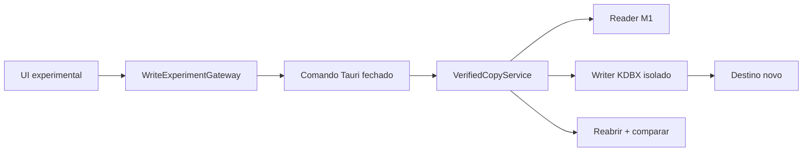

# M2 — escrita KDBX experimental e recuperável

- **Status:** planejamento; nenhuma escrita implementada
- **Data:** 2026-08-03
- **Plataforma inicial:** Windows
- **Dados permitidos:** fixtures públicas, artificiais e descartáveis

## Objetivo

O M2 deve provar que o MyVault consegue produzir uma cópia KDBX válida sem arriscar o arquivo de origem. O marco não autoriza uso com credenciais reais e não transforma o aplicativo em produto pronto para produção.

A primeira entrega é um experimento de round-trip sem mutação. Edição, substituição e recuperação avançam apenas por gates separados descritos no [ADR 005](DECISIONS/005-safe-kdbx-copy-on-write.md).

## Invariantes

1. O arquivo aberto pelo fluxo M1 é sempre imutável.
2. Nenhuma operação escreve antes de a pessoa escolher um novo destino.
3. O destino de M2A deve não existir.
4. Uma cópia só é declarada válida depois de sincronizada, reaberta e verificada.
5. Campos protegidos nunca atravessam o IPC ou entram no estado React.
6. Nenhuma falha remove a origem, uma cópia válida anterior ou o único backup conhecido.
7. Estado incerto interrompe o fluxo e preserva artefatos necessários à recuperação.
8. Compatibilidade é declarada por fixture, cliente, plataforma e versão verificadas.

## Sequência de implementação

### Gate 0 — decisão e laboratório

- ADR, especificação e modelo de ameaças aprovados;
- auditoria da feature `save_kdbx4` e de seu grafo de dependências;
- proof of concept somente em teste Rust, sem comando Tauri;
- nenhuma mudança de capacidade visível na UI.

### Gate 1 — M2A: round-trip sem mutação

Fluxo permitido:

```text
fixture KDBX 4.1 somente leitura
          ↓
serviço Rust de laboratório
          ↓
novo arquivo escolhido pela pessoa
          ↓
write + flush + sync
          ↓
reabertura e verificação Rust
          ↓
teste de interoperabilidade independente
```

O nome de comando, se o laboratório chegar ao Tauri, deve deixar o limite explícito, por exemplo `export_verified_fixture_copy`. Ele não recebe DTO genérico de banco e não substitui arquivos.

### Gate 2 — M2B: mutação controlada

Requer especificação complementar para a primeira operação. O contrato será orientado por intenção, com identificadores opacos e allowlist de campos. Não haverá endpoint `save_database`, `patch_json` ou equivalente.

Antes desse gate, deve existir decisão explícita sobre como valores protegidos são editados sem expandir desnecessariamente sua permanência no JavaScript e no IPC.

### Gate 3 — M2C: commit transacional

Requer adaptador de filesystem por plataforma, detecção de conflito, backup, fault injection e runbook de recuperação. A substituição de uma cópia administrada pelo MyVault continua distinta do arquivo original importado.

## Escopo do M2A

### Incluído

- fixture KDBX 4.1 válida e documentada;
- senha pública e caso existente com arquivo-chave público;
- nova cópia no mesmo filesystem local;
- escrita integral pelo núcleo Rust;
- reabertura com chave correta e comparação semântica;
- cancelamento, destino existente, permissão negada, disco cheio simulado e escrita interrompida;
- verificação manual no KeePassXC ou outro cliente independente registrado;
- mensagens públicas redigidas e estados acessíveis na UI, se houver UI.

### Fora de escopo

- sobrescrever ou renomear a origem;
- uso de credenciais reais;
- KDBX 3.1/4.0, migração automática ou downgrade;
- editar, revelar, copiar ou exportar segredos pelo React;
- rotação de senha/chave, challenge-response ou hardware key;
- arquivos em nuvem, rede, compartilhamentos, FAT/exFAT ou volume removível;
- merge de alterações concorrentes;
- sync, histórico de backups ou retenção automatizada;
- Linux/macOS release;
- promessa de atomicidade antes do Gate 3.

## Arquitetura proposta



- `ReadOnlyVaultService` não recebe métodos de escrita;
- o laboratório depende de interfaces internas para reader, writer e filesystem;
- a capacidade `write` permanece `false` nas sessões M1;
- a UI nunca recebe o objeto descriptografado nem a representação do parser;
- o filesystem não é liberado genericamente ao WebView.

## Validação de equivalência

Comparar apenas XML ou bytes não é suficiente: seeds, IVs e campos protegidos podem mudar corretamente entre serializações. A validação deve reabrir a cópia e comparar uma projeção interna abrangente, sem serializá-la para o frontend.

Cobertura mínima:

- hierarquia, UUIDs e ordem de grupos/entradas;
- todos os campos padrão e personalizados;
- valores protegidos após nova abertura;
- histórico de entradas;
- anexos e referências binárias;
- ícones personalizados;
- metadados, timestamps e objetos excluídos;
- cipher, KDF, parâmetros, compressão e versão;
- ausência de redução de custo criptográfico.

Campos deliberadamente regenerados devem ser listados e justificados. Qualquer perda silenciosa bloqueia o writer.

## Modelo de erros

| Código                     | Situação pública                | Regra de recuperação                          |
| -------------------------- | ------------------------------- | --------------------------------------------- |
| `CANCELLED`                | seleção cancelada               | nenhuma escrita iniciada                      |
| `DESTINATION_EXISTS`       | destino já existe               | escolher outro nome; nunca substituir         |
| `DESTINATION_UNWRITABLE`   | destino não pode ser criado     | preservar origem e estado atual               |
| `WRITE_FAILED`             | cópia não pôde ser concluída    | remover temporário incompleto quando seguro   |
| `SYNC_FAILED`              | cópia não pôde ser sincronizada | não declarar sucesso                          |
| `VERIFY_FAILED`            | cópia não reabriu ou divergiu   | manter origem; marcar cópia como inválida     |
| `UNSUPPORTED_WRITE_FORMAT` | formato não autorizado no M2    | nenhuma migração implícita                    |
| `CONFLICT_DETECTED`        | arquivo mudou desde a abertura  | interromper; nunca substituir                 |
| `RECOVERY_REQUIRED`        | resultado do commit é incerto   | preservar backup/temporário e mostrar runbook |
| `INTERNAL`                 | falha inesperada redigida       | sem caminho, segredo ou stack no IPC          |

M2A deve produzir apenas os códigos aplicáveis ao novo destino. Os códigos de conflito, backup e recuperação pertencem aos gates posteriores, mas são reservados agora para impedir APIs improvisadas.

## Plano de testes

### Unidade e propriedades

- máquina de estados impede saltar validação ou sincronização;
- nomes temporários são imprevisíveis e criados com exclusividade;
- redator de erros elimina caminhos, chaves e conteúdo;
- fingerprint muda quando a origem muda;
- parâmetros criptográficos abaixo da baseline são rejeitados.

### Integração Rust

- round-trip de todas as fixtures 4.1 autorizadas;
- chave correta reabre; chave errada falha;
- comparação semântica inclui dados protegidos internamente;
- origem mantém hash, tamanho e conteúdo em todos os caminhos;
- destino existente nunca é truncado;
- falhas injetadas antes/depois de write, flush, sync e verify;
- nenhuma sobra inesperada após falhas recuperáveis;
- arquivos inválidos e limites do M1 continuam rejeitados.

### Interoperabilidade

- abrir a cópia em cliente independente;
- registrar sistema operacional, filesystem, versão do cliente e versão KDBX;
- comparar campos, histórico, anexos, ícones e metadados;
- reabrir no MyVault após salvar no cliente independente;
- documentar qualquer diferença antes de ampliar a matriz.

### Segurança e CI

- `cargo fmt`, Clippy com warnings negados e testes Linux/Windows;
- auditoria do novo grafo de features;
- CodeQL Rust e JavaScript;
- busca automatizada por campos protegidos em tipos serializáveis;
- inspeção de logs, temporários e permissões no Windows;
- teste que prova `write: false` para toda sessão M1.

## Critérios de aceite do M2A

- [ ] ADR 005 e modelo de ameaças aprovados antes do primeiro código;
- [ ] feature de escrita não altera o contrato M1;
- [ ] origem permanece byte a byte inalterada;
- [ ] destino existente nunca é sobrescrito;
- [ ] cópia válida é sincronizada, reaberta e semanticamente equivalente;
- [ ] matriz independente confirma interoperabilidade;
- [ ] nenhum segredo chega ao React, IPC de saída, logs ou erros;
- [ ] falhas injetadas não causam perda da origem nem falso sucesso;
- [ ] somente fixtures públicas são usadas;
- [ ] documentação e avisos continuam dizendo experimental / não usar dados reais;
- [ ] todas as verificações obrigatórias do repositório passam;
- [ ] aceite manual no aplicativo real registra evidências e versões.

## Condições que abortam o writer escolhido

- perda de qualquer campo não explicitamente descartável;
- impossibilidade de preservar KDF/cipher sem downgrade;
- saída que não abre em cliente independente;
- panic, erro não redigido ou segredo no IPC/log;
- dependência abandonada, advisory não mitigável ou feature excessiva;
- necessidade de escrever no arquivo de origem para completar M2A;
- resultado inconsistente entre Windows e a suíte Rust.

## Definição de pronto

M2A termina quando uma nova cópia descartável é produzida e verificada com evidência suficiente para decidir se o writer pode avançar. Ele não termina com edição habilitada, substituição de arquivo ou uso real.

M2 completo exige ainda M2B e M2C aprovados, interoperabilidade repetida, recuperação exercitada e nova revisão independente. Até lá, a interface pública permanece experimental.

## Referências

- [ADR 005 — cópia verificada](DECISIONS/005-safe-kdbx-copy-on-write.md)
- [Delta do modelo de ameaças](M2-THREAT-MODEL.md)
- [M1 — núcleo somente leitura](M1-SPEC.md)
- [Matriz KDBX](KDBX-COMPATIBILITY.md)
- [Especificação oficial KDBX 4.1](https://keepass.info/help/kb/kdbx.html)
- [Microsoft `ReplaceFileW`](https://learn.microsoft.com/en-us/windows/win32/api/winbase/nf-winbase-replacefilew)
