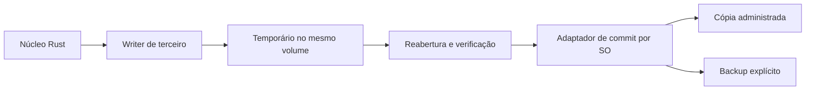

# Delta do modelo de ameaças — M2 escrita experimental

- **Status:** baseline aprovado; revisão obrigatória antes de cada gate de código
- **Data:** 2026-08-03
- **Base:** [modelo de ameaças do M1](THREAT-MODEL.md)

## Aviso

Este documento adiciona ameaças de escrita ao modelo M1. Ele não é auditoria, não autoriza credenciais reais e não reduz os riscos residuais já documentados.

## Novos ativos

- cópia KDBX recém-serializada;
- arquivo temporário e backup criptografados;
- parâmetros de cipher, KDF e compressão;
- permissões, ACLs, timestamps, streams e identidade do arquivo;
- fingerprint usado para detectar edição concorrente;
- runbook e artefatos de recuperação.

## Novas fronteiras

O writer e o adaptador de commit são fronteiras distintas. Uma serialização válida não prova que a substituição é segura, e uma operação de filesystem bem-sucedida não prova fidelidade do conteúdo.

## Ameaças adicionais

| ID  | Ameaça                                           | Impacto                           | Controle exigido                                                         | Risco residual                                   |
| --- | ------------------------------------------------ | --------------------------------- | ------------------------------------------------------------------------ | ------------------------------------------------ |
| W1  | writer omite ou altera campos                    | perda silenciosa de dados         | round-trip semântico abrangente e cliente independente                   | formatos raros podem não estar nas fixtures      |
| W2  | KDF/cipher é enfraquecido                        | redução de proteção               | baseline fechada, comparação antes/depois e rejeição de downgrade        | parâmetros fortes não corrigem outros vazamentos |
| W3  | escrita parcial é tratada como sucesso           | cofre corrompido                  | write/flush/sync/verify em estados explícitos; fault injection           | garantias variam por filesystem e hardware       |
| W4  | destino existente é truncado                     | perda de arquivo                  | M2A usa `create_new`; substituição só no Gate 3                          | caminho pode mudar entre seleção e criação       |
| W5  | arquivo muda após abertura                       | sobrescrita de edição externa     | fingerprint e verificação imediatamente antes do commit                  | comparação não oferece merge semântico           |
| W6  | symlink/reparse point redireciona escrita        | arquivo errado modificado         | handle e identidade validados; política específica por SO                | semântica difere entre plataformas               |
| W7  | temporário/backup fica acessível                 | exposição de metadados ou cofre   | mesmo diretório, nome imprevisível, permissões mínimas e limpeza testada | cópia continua sensível apesar de criptografada  |
| W8  | queda ocorre durante substituição                | origem ou destino ausente/incerto | backup, API de commit por SO e runbook; preservar artefatos              | hardware pode mentir sobre durabilidade          |
| W9  | permissões/ACL/streams se perdem                 | exposição ou incompatibilidade    | capturar e validar metadados; usar API adequada ao SO                    | preservação completa pode não ser portátil       |
| W10 | erro de recuperação remove a última cópia válida | perda definitiva                  | nunca limpar backup em estado incerto; recuperação idempotente           | decisão humana ainda pode apagar arquivos        |
| W11 | segredo é exposto para permitir edição           | vazamento no WebView/IPC          | M2A sem edição; M2B exige contrato por intenção e revisão própria        | JavaScript não oferece limpeza garantida         |
| W12 | backup antigo causa rollback                     | perda de mudanças recentes        | metadados e fingerprint claros; restauração explícita                    | pessoa pode escolher arquivo incorreto           |
| W13 | duas instâncias salvam concorrentemente          | last-write-wins ou corrupção      | lock/fingerprint e recusa de conflito                                    | locks podem ser ignorados por outros clientes    |
| W14 | dependência/feature amplia superfície            | execução indevida ou regressão    | pin, lockfile, feature mínima, audit e CodeQL                            | supply chain não é eliminada                     |
| W15 | UI faz promessa maior que o gate                 | uso prematuro com dados reais     | rótulos persistentes e capacidades fechadas                              | avisos podem ser ignorados                       |

## Pressupostos adicionais

- M2A opera em filesystem local do Windows e em fixtures descartáveis;
- existe espaço suficiente apenas nos casos de sucesso; falta de espaço é injetada nos testes;
- o sistema operacional e a máquina de teste não estão comprometidos;
- o cliente independente usado na matriz é obtido por canal confiável;
- backup não é sinônimo de atomicidade nem de recuperação comprovada.

## Regras de segredo e logging

- não registrar valores, chaves, XML, buffers, caminhos absolutos ou nomes de temporários;
- fingerprints usam somente ciphertext e não atravessam a UI quando não necessários;
- mensagens públicas informam etapa e ação de recuperação, sem detalhes do parser;
- falhas de interoperabilidade usam fixtures públicas;
- nenhum artefato é enviado a serviço externo.

## Gates de revisão

Revisar este documento:

- antes de habilitar `save_kdbx4`;
- após o primeiro round-trip real;
- antes de expor qualquer comando Tauri de escrita;
- antes da primeira mutação de campo protegido;
- antes de criar backup ou substituir arquivo;
- ao adicionar plataforma, filesystem ou formato;
- após advisory, mudança de writer ou mudança de parâmetros criptográficos.

## Riscos que bloqueiam dados reais

- writer de KDBX 4.1 continua experimental;
- não há auditoria independente do caminho completo;
- proteção de memória, swap e crash dumps segue sem garantia;
- edição de segredo exigiria novas passagens por JavaScript/IPC;
- durabilidade e recuperação ainda não foram demonstradas sob falha de energia;
- matriz de interoperabilidade é limitada;
- distribuição Linux segue bloqueada pela issue #15.

## Evidência necessária para encerrar o delta

Este delta não é encerrado ao completar M2A. Ele só pode ser substituído por um modelo revisado após M2C, com resultados de fault injection, recuperação manual, interoperabilidade, permissões e revisão independente anexados.

## Referências

- [ADR 005](DECISIONS/005-safe-kdbx-copy-on-write.md)
- [Especificação do M2](M2-SPEC.md)
- [Modelo de ameaças do M1](THREAT-MODEL.md)
- [Microsoft `ReplaceFileW`](https://learn.microsoft.com/en-us/windows/win32/api/winbase/nf-winbase-replacefilew)
- [Rust `std::fs::rename`](https://doc.rust-lang.org/std/fs/fn.rename.html)
