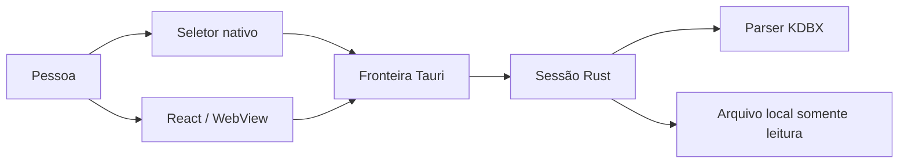

# Modelo de ameaças — M1 KDBX somente leitura

- **Status:** revisado após a implementação e a validação automatizada
- **Escopo:** marco M1
- **Data:** 2026-07-28

## Aviso

Este documento orienta um experimento com fixtures descartáveis. Ele não é uma auditoria, não prova segurança e não autoriza o uso de credenciais reais.

## Sistema analisado

O preview web com mocks não abre KDBX e está fora do caminho nativo. No desktop, caminho, senha e arquivo-chave cruzam o IPC uma vez; o resultado normal contém apenas resumos não secretos.

## Ativos

- senha mestra e conteúdo do arquivo-chave;
- banco descriptografado e campos protegidos;
- arquivo KDBX original e sua integridade;
- caminho e metadados locais do arquivo;
- identificador da sessão e projeções exibidas;
- logs, mensagens de erro e dumps de crash;
- integridade da aplicação, dependências e builds.

## Fronteiras de confiança

1. **Pessoa → seletor/UI:** entradas são não confiáveis.
2. **WebView → comandos Tauri:** todo payload deve ser validado novamente no Rust.
3. **Rust → parser de terceiros:** arquivos válidos ou malformados podem atingir código de dependência.
4. **Rust → filesystem:** caminhos, links e permissões podem mudar entre seleção e abertura.
5. **Aplicação → sistema operacional:** memória, clipboard, processos e crash dumps não estão totalmente sob controle do MyVault.
6. **Fonte → dependências/build:** atualizações podem introduzir código ou comportamento inesperado.

## Pressupostos do M1

- a máquina de teste e o sistema operacional não estão comprometidos;
- somente fixtures públicas, artificiais e descartáveis são abertas;
- o arquivo é selecionado conscientemente pela pessoa;
- o binário é construído a partir do código e lockfile revisados;
- não há promessa de proteção contra administrador local, malware, captura de tela ou análise de RAM.

## Ameaças e controles

| ID  | Ameaça                                                           | Impacto                           | Controles exigidos no M1                                                                                              | Risco residual                                                   |
| --- | ---------------------------------------------------------------- | --------------------------------- | --------------------------------------------------------------------------------------------------------------------- | ---------------------------------------------------------------- |
| T1  | KDBX malformado explora bug ou pânico no parser                  | crash ou execução indevida        | versão exata fixada; fixtures negativas; erros encapsulados; `cargo audit`; sem dados reais                           | conjunto completo não passou por auditoria independente          |
| T2  | KDF, compressão ou cardinalidade exaure CPU/memória              | negação de serviço                | limites de arquivo, memória KDF, profundidade, grupos e entradas; uma abertura por vez                                | alocação pode ocorrer antes de todos os limites serem aplicáveis |
| T3  | senha ou arquivo-chave vazam pelo IPC, store ou UI               | exposição de segredo              | estado efêmero; nenhum log; limpeza do formulário; Rust usa wrappers com limpeza best-effort; testes de serialização  | strings e cópias internas não têm limpeza garantida              |
| T4  | conteúdo secreto retorna por engano ao React                     | exposição no WebView/devtools     | DTO allowlist sem senha, TOTP, notas, campos, histórico ou anexos; testes de contrato                                 | títulos, usuários e URLs ainda podem ser sensíveis em uso real   |
| T5  | erro revela caminho, chave, cabeçalho ou stack trace             | vazamento local                   | códigos públicos fechados; mensagens redigidas; detalhes apenas internos e sem segredo                                | ferramentas externas de crash podem capturar estado              |
| T6  | arquivo original é sobrescrito ou truncado                       | perda de dados                    | `File::open` somente leitura; nenhuma feature de escrita; hash antes/depois; fixtures em cópia                        | software externo pode modificar o arquivo simultaneamente        |
| T7  | troca por link simbólico ou mudança entre seleção e leitura      | arquivo diferente é aberto        | abrir uma vez, operar pelo mesmo handle e apresentar nome reduzido; não seguir caminhos adicionais vindos do conteúdo | sem identidade forte multiplataforma do arquivo no M1            |
| T8  | sessão antiga é reutilizada após fechar/bloquear                 | acesso além do esperado           | identificador aleatório opaco; sessão única; invalidação idempotente; descarte em todos os gatilhos                   | limpeza física de memória não é garantida                        |
| T9  | permissões Tauri amplas permitem leitura arbitrária pelo WebView | expansão de privilégio            | seletor nativo e comando estreito; nenhuma permissão genérica de filesystem; validação no Rust                        | vulnerabilidade no shell ou plugin permanece possível            |
| T10 | dependência comprometida ou vulnerável                           | comprometimento do núcleo         | versão exata e lockfile; licença e origem verificadas; `cargo audit`; revisão de mudanças antes de upgrades           | não existe auditoria independente do conjunto completo           |
| T11 | UI sugere que o modo experimental é seguro/editável              | uso indevido e perda de confiança | badges persistentes; ações sensíveis desativadas; aviso antes da abertura; documentação explícita                     | a pessoa pode ignorar avisos                                     |
| T12 | dados chegam ao clipboard ou rede                                | exfiltração                       | nenhum segredo retornado; nenhuma ação de cópia; nenhuma chamada de rede/telemetria                                   | extensões, OS e outras aplicações estão fora do controle         |

## Regras de logging e diagnóstico

- não registrar senha, arquivo-chave, campos KDBX, caminho absoluto ou conteúdo do parser;
- usar somente código do erro, etapa (`select`, `open`, `parse`, `project`, `close`) e ID aleatório da tentativa;
- não enviar telemetria ou crash report automaticamente;
- falhas de debug locais devem usar fixtures públicas;
- revisar mensagens transitivas da biblioteca antes de incluí-las em qualquer log.

## Regras de dados

- nenhuma persistência em `localStorage`, IndexedDB ou arquivo auxiliar;
- nenhum arquivo temporário descriptografado;
- nenhum registro de arquivos recentes;
- nenhum cache entre sessões;
- anexos e campos protegidos permanecem no núcleo e não são serializados;
- o arquivo de origem é tratado como imutável.

## Fora do modelo

- malware, keylogger, screen capture ou processo com privilégio equivalente/superior;
- ataques físicos, cold boot, swap, hibernação e dumps administrados pelo sistema;
- garantias de sandbox idênticas em todos os sistemas operacionais;
- escrita atômica, backup, restauração e conflitos de sincronização;
- distribuição assinada, atualização segura ou cadeia de release;
- proteção de credenciais reais.

## Riscos que bloqueiam produção

- senha atravessa memória JavaScript e IPC;
- conteúdo descriptografado pode deixar cópias não controladas em dependências;
- parser e aplicação não passaram por auditoria independente;
- compatibilidade ainda depende de fixtures limitadas;
- não existe estratégia validada de memória bloqueada, crash dump ou swap;
- M1 não oferece escrita, recuperação ou backups.

## Gatilhos de revisão

Este modelo deve ser revisado quando houver:

- primeiro código do gateway e dos comandos;
- alteração da biblioteca ou de suas features;
- retorno de qualquer novo campo ao frontend;
- suporte a escrita, anexos, TOTP, clipboard ou persistência;
- nova permissão Tauri;
- expansão para outro sistema operacional;
- publicação de advisory relevante.

## Revisão pós-implementação

Em 2026-07-28, o contrato IPC, os limites do parser, as permissões Tauri, as projeções retornadas ao React e os testes de fixtures foram comparados com este modelo. Formatação, Clippy, testes Rust em Linux/Windows, testes frontend e auditorias npm/Rust passaram no PR do M1. O aceite manual confirmou abertura, projeção somente leitura, bloqueio e retorno ao modo mock no Windows; os demais gatilhos de descarte são cobertos por testes e os riscos residuais acima continuam válidos.

## Referências

- [Especificação oficial KDBX 4.1](https://keepass.info/help/kb/kdbx.html)
- [Política de segurança do keepass-rs](https://github.com/sseemayer/keepass-rs/blob/master/SECURITY.md)
- [Especificação funcional do M1](M1-SPEC.md)
- [Política de fixtures](../src-tauri/tests/fixtures/kdbx/README.md)
